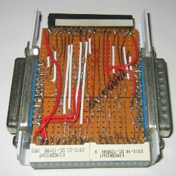

===========================
Parallel port monitor
===========================

Status: OK

It is used for monitoring the parallel port signals. 
 
Images
-------

.. image:: parallelmonitor1.jpg
    

..  [[[cog
..  s=open('docs/template1.txt').read().format(project='parallelmonitor')
..  cog.outl(s)
..  ]]]

Schematic
----------

      .. eagle-image:: parallelmonitor.sch
                :resolution: 150

.. raw:: latex

  \newpage % hard pagebreak at exactly this position 

Board
----------

Normal, bottom mirrored, wires only:

      .. eagle-image:: parallelmonitor.brd
                :command:   display all
                :resolution: 300

      .. eagle-image:: parallelmonitor.brd
                :resolution: 300
                :layers: pads,vias, bottom, dimension
                :mirror:

      .. eagle-image:: parallelmonitor.brd
                :resolution: 300
                :layers: document, pads,vias, top, dimension

Partlist
----------

      .. eagle-partlist:: parallelmonitor.brd
            :header: part, value , position

3D view
----------

------------
Front
------------

      .. eagle-image3d:: parallelmonitor.brd

------------
Right side
------------

      .. eagle-image3d:: parallelmonitor.brd
            :pcbrotate:  90,45,90

------------
Left side
------------

      .. eagle-image3d:: parallelmonitor.brd
            :pcbrotate:  90,-45,-90

------------
Bottom
------------

      .. eagle-image3d:: parallelmonitor.brd
            :pcbrotate:  0,0,180

          

..  [[[end]]]

Sources
-----------

`original idea <http://logix4u.net/Legacy_Ports/Parallel_Port/A_tutorial_on_Parallel_port_Interfacing.html>`_

      .. image:: http://logix4u.net/images/stories/legacy_ports/parallel_port/tutorial/paralleltest.gif

      .. image:: http://logix4u.net/images/stories/legacy_ports/parallel_port/tutorial/parallel.gif

 