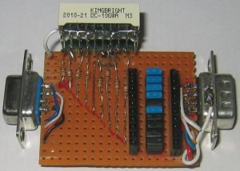

=======================
serial port monitor
=======================

Status: OK

On each signal there is one LED for positive 
and one LED for negative voltage. 
It is easy to change connections or
connect external parts. Examples_: Loop-Back, Null Modem,..

.. _examples: http://www.alloy.com.au/support.asp?TID=194

..  [[[cog
..  s=open('docs/template1.txt').read().format(project='serial_port_monitor')
..  cog.outl(s)
..  ]]]

Schematic
----------

      .. eagle-image:: serial_port_monitor.sch
                :resolution: 150

.. raw:: latex

  \newpage % hard pagebreak at exactly this position 

Board
----------

Normal, bottom mirrored, wires only:

      .. eagle-image:: serial_port_monitor.brd
                :command:   display all
                :resolution: 300

      .. eagle-image:: serial_port_monitor.brd
                :resolution: 300
                :layers: pads,vias, bottom, dimension
                :mirror:

      .. eagle-image:: serial_port_monitor.brd
                :resolution: 300
                :layers: document, pads,vias, top, dimension

Partlist
----------

      .. eagle-partlist:: serial_port_monitor.brd
            :header: part, value , position

3D view
----------

------------
Front
------------

      .. eagle-image3d:: serial_port_monitor.brd

------------
Right side
------------

      .. eagle-image3d:: serial_port_monitor.brd
            :pcbrotate:  90,45,90

------------
Left side
------------

      .. eagle-image3d:: serial_port_monitor.brd
            :pcbrotate:  90,-45,-90

------------
Bottom
------------

      .. eagle-image3d:: serial_port_monitor.brd
            :pcbrotate:  0,0,180

          

..  [[[end]]]

Images
-------

    
.. image:: img2.jpg

